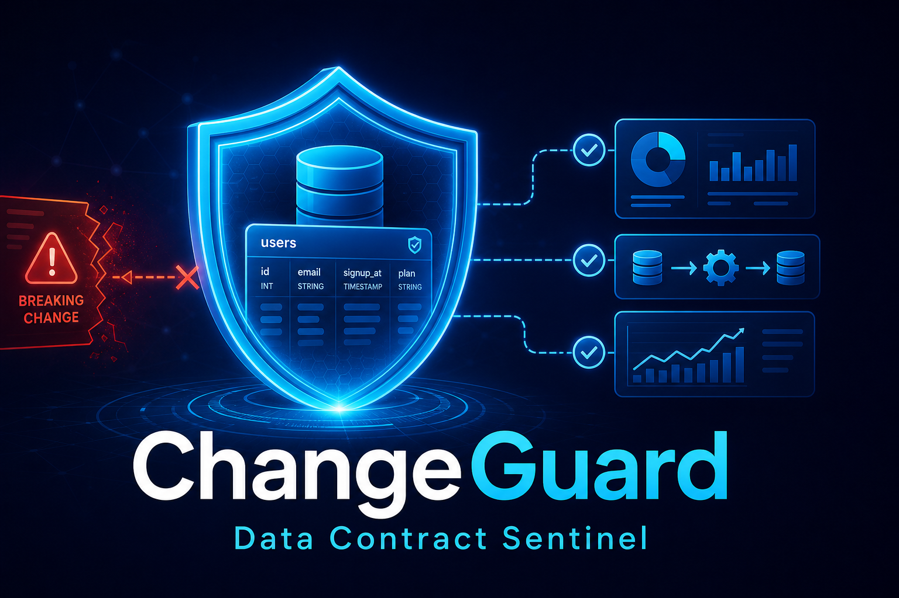

# ChangeGuard: Pre-Deployment Data Contract Sentinel



**ChangeGuard** is an autonomous agent that prevents breaking data contract changes before they reach production. It reads DataHub's lineage graph through the official DataHub MCP Server, traces column-level downstream impact, scores risk with transparent rules, and produces a BLOCK/ALLOW deployment decision with a concrete migration checklist.

Built for **[Build with DataHub: The Agent Hackathon](https://datahub.devpost.com/)** — Category: *Agents That Do Real Work*.

**Live public demo:** [https://changeguard-sentinel.streamlit.app](https://changeguard-sentinel.streamlit.app)

---

## What ChangeGuard Does

Schema changes (renaming a column, dropping a field, changing a type) routinely break dashboards, downstream tables, and ML pipelines without warning, because nobody traces the blast radius before deploying. ChangeGuard closes that gap: given a proposed change, it asks DataHub what actually depends on that column, scores the risk with visible, reproducible rules, and tells you whether it's safe to ship.

---

## Architecture: ChangeGuard → MCP → DataHub

```
┌─────────────────────────────────────────────────────────────┐
│                  PROPOSED SCHEMA CHANGE                       │
│         rename commerce.orders.customer_id → cust_key        │
└──────────────────────────┬──────────────────────────────────┘
                           │
                           ▼
┌──────────────────────────────────────────────────────────────┐
│                 CHANGEGUARD AGENT (contract_sentinel/agent.py)│
│                                                              │
│  Step 1 → Parse & validate change                            │
│  Step 2 → Resolve dataset URN in DataHub (search)            │
│  Step 3 → Fetch column-level downstream lineage (get_lineage)│
│  Step 4 → Score risk (transparent rules, no LLM)             │
│  Step 5 → Generate impact report with migration checklist    │
│  Step 6 → Write report back to DataHub (save_document, opt.) │
│  Step 7 → BLOCK or ALLOW deployment decision                 │
│                                                              │
└──────────────────────────┬──────────────────────────────────┘
                           │  MCP stdio (uvx mcp-server-datahub)
                           ▼
┌──────────────────────────────────────────────────────────────┐
│                 DataHub MCP Server (acryldata/mcp-server-datahub) │
│                 search · get_lineage · get_entities · ...     │
└──────────────────────────┬──────────────────────────────────┘
                           │  HTTP (GMS API)
                           ▼
┌──────────────────────────────────────────────────────────────┐
│                 DataHub (metadata catalog + lineage graph)    │
└──────────────────────────────────────────────────────────────┘
```

ChangeGuard never talks to DataHub's HTTP API directly. All metadata access goes through the official, open-source **`mcp-server-datahub`** package (https://github.com/acryldata/mcp-server-datahub), launched as a local subprocess over stdio via `uvx`.

---

## Demo Mode vs Live Mode

The app has two distinct data sources, selectable in the sidebar:

| | **Demo (fixtures)** | **Live (DataHub MCP)** |
|---|---|---|
| Data source | Reproducible in-memory fixtures (`contract_sentinel/fixtures.py`) | A real DataHub instance, queried live via MCP |
| Requires DataHub running? | No | Yes |
| Requires `uvx`/`uv` installed? | No | Yes |
| On connection/query failure | N/A | Shows the real error. **Never falls back to fixtures or demo data.** |
| Where it works | Anywhere, including the public Streamlit Cloud deployment | Only where the DataHub instance and MCP server are reachable |

This distinction is enforced in code, not just in the UI: in Live mode, if the MCP connection fails or a tool call errors, `contract_sentinel/agent.py` returns the failure immediately — it does not substitute `SHOWCASE_ASSETS` or any other fixture data. This is covered by dedicated tests (see [`tests/test_agent.py`](tests/test_agent.py), `LiveModeShapeTests`).

### Important: the public Streamlit app is Demo-only

**[https://changeguard-sentinel.streamlit.app](https://changeguard-sentinel.streamlit.app)** runs on Streamlit Community Cloud, which has no network path to a DataHub instance running on `localhost` on someone's own machine. The public deployment is meant to showcase the agent pipeline, the risk-scoring logic, and the reporting/UI using Demo mode.

**Live mode against real DataHub is demonstrated locally** (see below) — this is what the submission video shows, and it is what a judge running the project on their own machine with their own DataHub instance would also see.

---

## DataHub MCP Integration

ChangeGuard uses the official **`mcp-server-datahub`** (PyPI package, launched via `uvx`) over stdio. On connect, `MCPStdioClient` performs the full MCP handshake (`initialize` → `notifications/initialized` → `tools/list`) before issuing any tool call.

| MCP Tool Used | Required? | Purpose |
|---|---|---|
| `search` | Yes | Find datasets by name → resolve URN |
| `get_entities` | Yes | Retrieve asset metadata and ownership |
| `list_schema_fields` | Yes | Understand column structure |
| `get_lineage` | Yes | Column-level downstream traversal |
| `get_lineage_paths_between` | Yes | Trace full dependency path |
| `save_document` | **No — optional** | Write impact report back to DataHub |

`save_document` is a Document Tool, not a Mutation Tool, and `mcp-server-datahub` automatically hides it when the DataHub instance has no documents yet in its catalog. ChangeGuard treats it as optional: Live mode connects and runs the full search → lineage → risk → decision flow even when `save_document` is unavailable. If it is unavailable, the "Write report back to DataHub" option is disabled and the writeback step is skipped with a clear reason, instead of silently failing or blocking the connection.

### Writeback Safety

Writing back to DataHub always requires explicit user confirmation (a checkbox in the UI / `confirm_writeback=True` in code). This is enforced with a `PermissionError` gate in `contract_sentinel/datahub_mcp.py`, independent of whether `save_document` happens to be available.

---

## Quick Start

### Prerequisites

- Python 3.11+
- No paid API keys required (deterministic agent, no LLM dependency)

### Run the Agent (CLI, Demo mode)

```bash
git clone https://github.com/javierbolivia/changeguard-datahub.git
cd changeguard-datahub
python demo.py
```

### Run the Visual Interface (Demo mode, no setup)

```bash
pip install -r requirements.txt
streamlit run app.py
```

### Run Tests

```bash
python -m unittest discover -s tests -v
```

### Run Against Real DataHub (Live Mode, local)

1. Install `uv` (provides `uvx`), used to launch the official MCP server:

```bash
curl -LsSf https://astral.sh/uv/install.sh | sh
```

2. Start DataHub locally with Docker ([Quickstart Guide](https://datahubproject.io/docs/quickstart)):

```bash
pip install acryl-datahub
python -m datahub docker quickstart
```

This brings up DataHub's GMS API at `http://localhost:8080` and the frontend at `http://localhost:9002`.

3. Populate the catalog with at least one dataset (the quickstart's own `ingest-sample-data` command may fail depending on your Python version; ingesting your own metadata via the DataHub SDK, or connecting to real production metadata, both work).

4. In the Streamlit sidebar, select **Live (DataHub MCP)**, confirm the DataHub GMS URL (default `http://localhost:8080`), and optionally provide a personal access token if your instance has authentication enabled.

5. Run the agent. On the first run, `uvx` downloads `mcp-server-datahub` automatically — no manual installation needed. See [`contract_sentinel/mcp_connection.py`](contract_sentinel/mcp_connection.py) for the connection implementation and [`examples/datahub-mcp.example.json`](examples/datahub-mcp.example.json) for an MCP client config template.

### Verified Real Example

The Live pipeline has been verified end-to-end against a real local DataHub instance seeded with:

- `commerce.orders` (`order_id`, `customer_id`, `amount`)
- `analytics.customer_orders` (`customer_id`)
- `analytics.sales_summary`
- Lineage: `commerce.orders` → `analytics.customer_orders` → `analytics.sales_summary`, including column-level lineage on `customer_id`

Running ChangeGuard in Live mode with `dataset=commerce.orders`, `column=customer_id`, `operation=rename`, `new_name=cust_key` produces:

- `resolve_urn` → real URN found via `search` (source: `datahub_search`)
- `fetch_lineage` → 1 real downstream asset found via `get_lineage` (`analytics.customer_orders`, real URN, source: `datahub_mcp`)
- Risk score: **50/100 (medium)** → decision: **ALLOW**

No fixture data was used at any point in this run.

---

## Project Structure

```
changeguard-datahub/
├── app.py                          # Streamlit UI: Demo + Live modes
├── demo.py                         # CLI demo (Demo mode, no dependencies)
├── contract_sentinel/
│   ├── __init__.py                 # Package exports
│   ├── agent.py                    # Autonomous 7-step agent pipeline
│   ├── risk.py                     # Transparent risk scoring engine
│   ├── report.py                   # Markdown report generator
│   ├── fixtures.py                 # Reproducible demo metadata
│   ├── datahub_mcp.py               # MCP tool boundary (required vs optional tools)
│   └── mcp_connection.py           # Live MCP stdio client (uvx mcp-server-datahub)
├── tests/
│   ├── test_agent.py                # Agent pipeline + real MCP response-shape tests
│   ├── test_risk.py                # Risk scoring tests
│   ├── test_report.py              # Report generation tests
│   └── test_datahub_mcp.py         # MCP adapter tests (incl. optional save_document)
├── examples/
│   ├── changeguard-impact-report.md   # Sample agent output
│   └── datahub-mcp.example.json       # MCP server config template
├── requirements.txt
├── LICENSE                         # Apache 2.0
└── README.md
```

---

## Risk Scoring Transparency

ChangeGuard uses **deterministic, explainable rules** instead of opaque LLM judgments. Every factor contributing to the score is visible:

| Factor | Points |
|--------|--------|
| `drop` operation | 55 base |
| `rename` operation | 45 base |
| `type_change` operation | 35 base |
| `add` operation | 5 base |
| Per downstream asset (capped at 25) | +5 |
| Per critical asset (capped at 20) | +10 |
| Per business dashboard (capped at 10) | +5 |

**Decision thresholds:** Critical (≥80) → BLOCK | High (≥60) → BLOCK | Medium (≥30) → WARN | Low (<30) → ALLOW

---

## Example Output (Demo Mode)

The included CLI demo evaluates a proposed `rename` of `commerce.orders.customer_id` against fixture metadata. The agent discovers:

- **3 downstream consumers** (fixture data)
- **2 critical assets** (Revenue Dashboard, Customer LTV dataset)
- **Risk score: 90/100** → Deployment BLOCKED
- Generated migration checklist with 5 action items

See the full output: [`examples/changeguard-impact-report.md`](examples/changeguard-impact-report.md)

---

## Why ChangeGuard?

| Problem | ChangeGuard Solution |
|---------|---------------------|
| Schema changes break downstream silently | Agent traces the real blast radius via DataHub lineage before deploy |
| No visibility into who is affected | Surfaces owners and critical assets from DataHub metadata |
| Risk is assessed subjectively | Transparent scoring with visible, testable factors |
| Knowledge stays in one person's head | Can write the impact report back to DataHub for the team |
| Requires expensive LLM APIs | Deterministic rules — free and reproducible |

---

## Technologies

- **Python 3.11+** — Core implementation
- **DataHub MCP Server** (`mcp-server-datahub`, via `uvx`) — Live metadata access
- **Streamlit** — Interactive demo/Live interface
- **Pydantic** — Data validation
- **NetworkX** — Graph traversal utilities

---

## Limitations

- The public Streamlit Cloud deployment only supports Demo mode (see above) — it cannot reach a DataHub instance on your local machine.
- Live mode's `resolve_urn` step falls back to a constructed URN (naming-convention guess) only if `search` returns zero results while otherwise succeeding; a hard connection or tool-call failure never falls back to any guess or fixture data, it surfaces the real error and stops.
- `save_document` writeback depends on the target DataHub instance already having at least one document in its catalog, or being configured to expose the tool regardless; ChangeGuard detects this at connect time and disables the option accordingly rather than failing.

---

## License

[Apache License 2.0](LICENSE)

---

## Team

Built by [@javierbolivia](https://github.com/javierbolivia) for the DataHub Agent Hackathon 2026.
